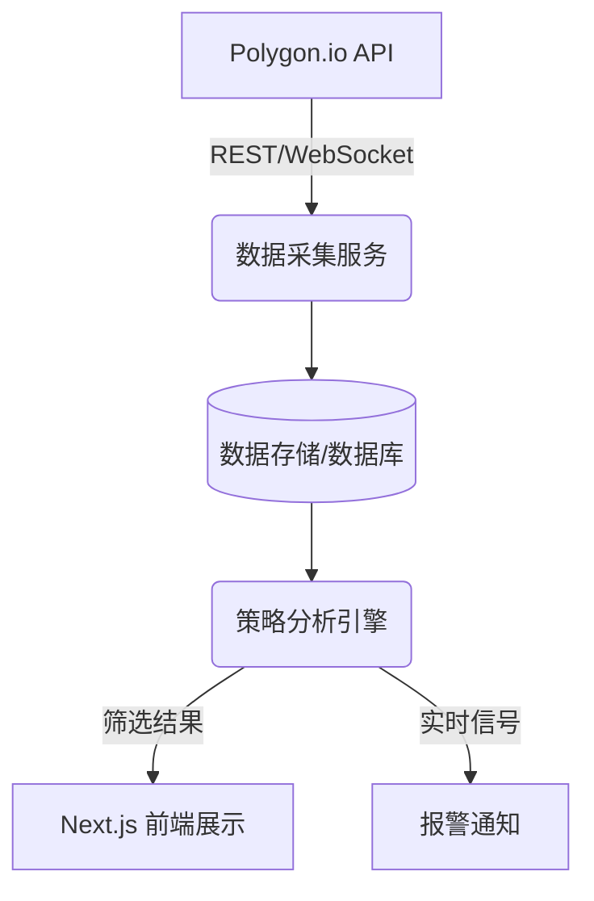

# 美股选股系统设计方案 (Stock Selection System Scheme)

## 1. 项目目标
构建一个基于 Polygon.io 行情数据的自动化美股选股系统，旨在通过技术指标和量化策略发现潜在的盈利机会。

## 2. 系统架构 (System Architecture)

系统分为三个核心层级：
1.  **数据层 (Data Layer)**: 负责与 Polygon.io 交互，获取历史和实时数据，并进行清洗存储。
2.  **策略层 (Strategy Layer)**: 运行选股算法，筛选符合条件的股票。
3.  **应用/展示层 (Application Layer)**: 用户界面 (Next.js)，展示选股结果、图表和报警。

## 3. 数据方案 (Data Strategy - Polygon.io)

我们将利用 Polygon.io 的以下接口：
*   **Reference Data (参考数据)**: 获取所有美股代码 (Tickers)，筛选出普通股 (Common Stocks)。
*   **Aggregates (Bars) (K线数据)**: 获取日K、小时K等历史数据，用于回测和每日复盘。
*   **WebSocket Clusters**: 获取实时全市场秒级聚合数据 (Aggregates)，用于盘中实时选股。

### 数据存储
*   **MVP阶段**: 可以使用文件系统 (JSON/CSV) 或 SQLite。
*   **生产阶段**: 推荐使用 PostgreSQL (配合 TimescaleDB 删除) 或 ClickHouse 处理时序数据。

## 4. 选股策略示例 (Selection Strategies)

我们将实现几个经典的量化选股策略：

### 策略 A: 趋势跟随 (Trend Following)
*   **逻辑**: 选取处于上升趋势的股票。
*   **指标**:
    *   股价 > 50日均线 (MA50) > 200日均线 (MA200) (多头排列)。
    *   RSI (14) 在 50-70 之间 (强势但未严重超买)。

### 策略 B: 动量突破 (Momentum Breakout)
*   **逻辑**: 选取突破关键阻力位或创近期新高的股票。
*   **指标**:
    *   股价突破 20日最高价 (Donchian Channel)。
    *   成交量放大 (Volume > 1.5倍 20日平均成交量)。

### 策略 C: 均值回归 (Mean Reversion) - 适合震荡市
*   **逻辑**: 选取超跌反弹的股票。
*   **指标**:
    *   股价触及布林带 (Bollinger Bands) 下轨。
    *   RSI (14) < 30 (超卖)。

## 5. 技术栈 (Tech Stack) - Confirmed

*   **Runtime**: Node.js (LTS)
*   **Language**: TypeScript (Configured)
*   **Frontend framework**: Next.js 16 (App Router)
*   **Database**: MongoDB (via Mongoose)
*   **API Client**: `@polygon.io/client-js`
*   **Technical Analysis**: `technicalindicators`
*   **Charting**: Lightweight Charts

## 6. 实施路线图 (Implementation Roadmap)

### 第一阶段：基础设施 & 历史数据选股 (MVP)
1.  **配置环境**: 安装 `@polygon.io/client-js`。
2.  **数据脚本**: 编写脚本拉取标普500或全市场 Ticker 列表。
3.  **每日扫描**: 编写脚本拉取昨日日K数据。
4.  **策略实现**: 实现 "趋势跟随" 算法，对昨日数据进行筛选。
5.  **展示**: 在 Next.js 页面上简单的表格展示筛选出的股票。

### 第二阶段：回测与优化
1.  **数据积累**: 下载过去 1-2 年的历史数据。
2.  **回测引擎**: 跑通策略在历史数据上的表现，计算胜率和盈亏比。
3.  **参数优化**: 调整均线周期、RSI 阈值等。

### 第三阶段：实时监控
1.  **WebSocket 集成**: 接入 Polygon WebSocket。
2.  **实时计算**: 维护内存中的实时K线，实时触发策略信号。
3.  **报警**: 邮件或 Telegram 推送。

## 7. 快速开始 (Next Steps)

1.  获取 Polygon.io API Key。
2.  安装依赖: `npm install @polygon.io/client-js technicalindicators`
3.  编写第一个脚本 `scripts/scan_stocks.ts`。
